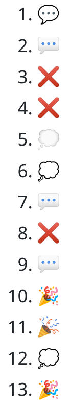

# What is going on with emojis on GitHub?

> **Note**
> This represents the state of GitHub on 2023-08-06, which might have been fixed in the
> meantime.

## The problem

On GitHub, such as within a README.md file, users can incorporate emojis. For instance, entering :tada: can produce:

 - The emoji text representation: "🎉" ...
 - Or sometimes an image of the emoji:

While different platforms with distinct fonts might render the text version variably, the image should look the same everywhere.

*But how is it decided which of those two is displayed?*

The selection appears chaotic.
This inconsistency suggests a potential bug rather than an intentional feature.

One would assume that if a series of emojis is entered, they'd either all be rendered as text or images consistently. This is not the case and without looking into it much deeper, I don't understand what's the pattern here.

You can take a look at the emojis in this [test repo](https://github.com/mo271/emoji-test) and check out how it looks for you.

Today the rendering of the emojis in this started like this:

