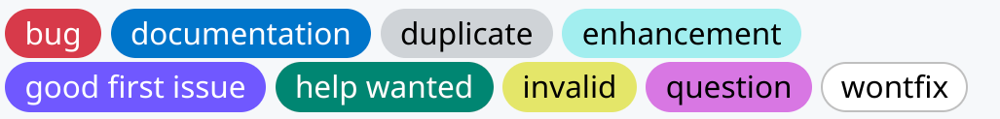
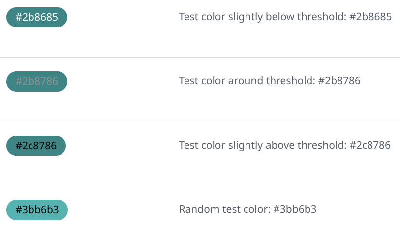
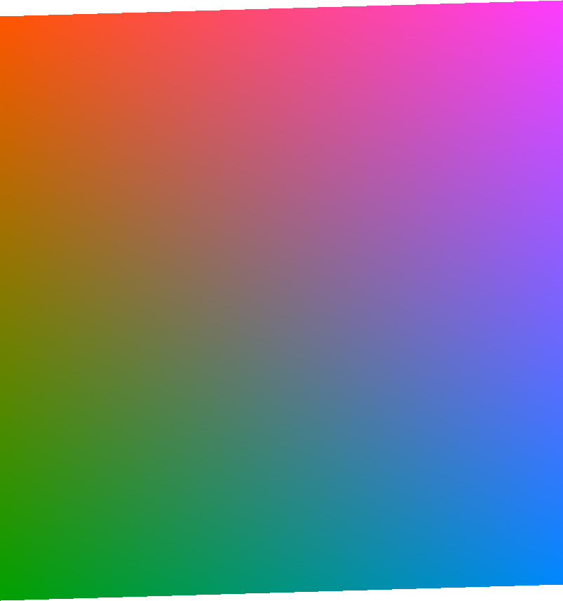
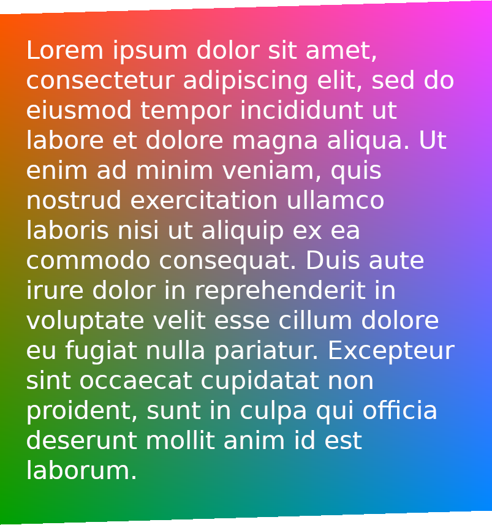
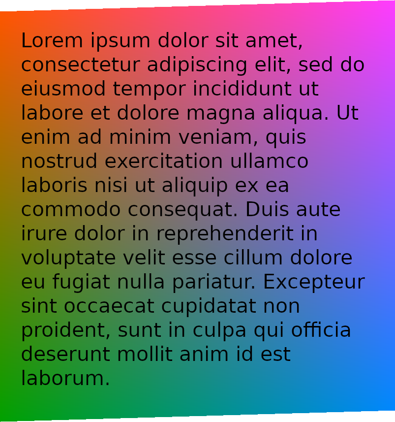
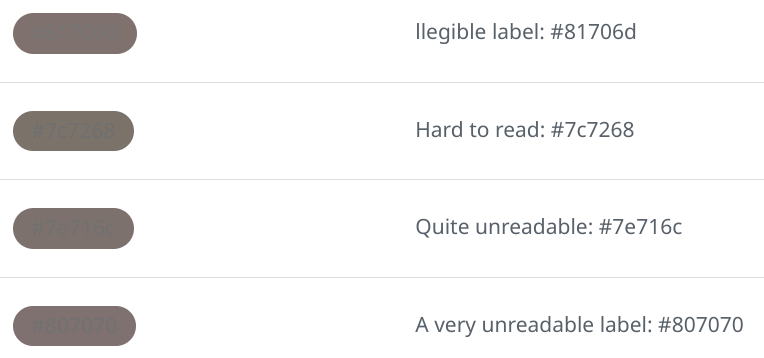

# Why some GitHub labels illegible

> **Note**
> This represents the state of GitHub labels on 2023-03-11, which might have been fixed in the
> meantime.

## The problem
On GitHub, it's possible to select the color of a [label](https://docs.github.com/de/issues/using-labels-and-milestones-to-track-work/managing-labels) when assigning it to a pull request or an issue.  When using GitHub with the Light default theme, the color of the text on those labels depends on the brightness of the color used: The darker the color of the label the brighter the color of the text of the label and vice versa. Here's how this looks like:

{: width="100%" }

In fact for most colors, the text on the label will be either black or white. Digging into the
[CSS](https://github.githubassets.com/assets/global-7f117b5cfae4.cssjavascript) that is used for the Light theme, we find the logic to decide on the color of the text. Assuming the color of the
label is in
`--label-r`, `--label-g` and `--label-b`, we have
```css
--perceived-lightness: calc( ((var(--label-r) * 0.2126) + (var(--label-g) * 0.7152) + (var(--label-b) * 0.0722)) / 255 );
--lightness-threshold: 0.453;
--lightness-switch: max(0, min(calc((var(--perceived-lightness) - var(--lightness-threshold)) * -1000), 1));
```
and then the color for the font is determined by
```
color:hsl(0deg, 0%, calc(var(--lightness-switch) * 100%))
```
So if the sRGB value of the color is (r,g,b) in the range [0, 255]^3, a `perceived-lightness` is calculated by the linear equation
```python
perceived_lightness = lambda r, g, b: (0.2126*r + 0.7152*g +  0.0722*b)/255
```
and essentially the text of the label will be colored white if `perceived-lightness<0.453` and black otherwise. However, when the `perceived-lightness` is very close to the threshold, we don't trigger the `min` or `max` and actually get some sort of grey color for the label.

Taking for example, taking the color `#3bb6b3 = (59, 182, 179)`, we get a `perceived-lightness` of `(0.2126*59 + 0.7152*182 +  0.0722*179)/255 = 0.6103...`, which is way above the threshold, hence the text for this color will be rendered in black.
For different shades of the same color we calculate as follows:

label color |  `perceived-lightness` | `lightness-switch`| text color
------------|------------------------|-------------------|------------
 `2b8685`   | `0.4493..`             | `1`               | `ffffff`
 `2b8786`   | `0.4524..`             | `0.5741..`        | `929292`
 `2c8786`   | `0.4532..`             | `0`               | `000000`
 `3bb6b3`   | `0.6103..`             | `0`               | `000000`



For `#2b8786`, we multiply `0.5741...` by `255` to get `146` or `0x92`. This grey `#929292` is already pretty hard to read, see below for worse cases of that behavior.

Let’s look at the above formulas geometrically.
We start with an sRGB color cube, with can be visualized like that:

<div id="demo">
  <canvas id="colorcube"></canvas>
</div>

The value where perceived-lightness equals the lightness-threshold is a plane cutting through the cube:

<div id="demo">
  <canvas id="cubecut"></canvas>
</div>


The intersection between the cube and the plane is a parallelogram, and we can make an orthonormal projection to two dimensions to get a clear look at it:

{: width="49%" }

Since these are the colors is the threshold where GitHub's algorithm switches from white to black for the text, both should be equally readable against that background. However, at least to my eyes, the white text is more readable:


{: width="49%" }
{: width="49%" }

Also note how the brightness is not uniform for those colors.
So what’s is going on? Well, CSS colors are understood to be in the sRGB color space, but the formula used is intended for *linear* RGB see [sRGB - Wikipedia](https://en.wikipedia.org/wiki/SRGB).
Therefore the correct calculation in should be (in pseudo-code):

```python

def linear_from_srgb_channel(c):
    return c/12.92 if c <= 0.04044823627710819170430880 else ((c + 0.055)/1.055)**2.4
def linear_from_srgb(r, g, b):
    return tuple(map(linear_from_srgb_channel, (r, g, b)))

improved_perceived_lightness = lambda r, g, b: perceived_lightness(*linear_from_srgb(r, g, b))
```
That shows that not doing the conversion to in general skews towards using black text too much.

This is one problem with the color of the text of the labels. Another problem the text for labels with a color very close to the threshold will actually be some shade of grey. I don't know what the idea behind that is, but it leads to quite unreadable labels, for instance:



You can take a look at those labels in a [test repo](https://github.com/mo271/label_colors_test/labels). In the Light default theme they are the most illegible label I could find. In Dark default theme they render fine, which might lead to people actually picking those color for their labels, even when there is a preview in the user interface.

## The solution...

### ... for the problem with grey text:
Never make the text color of labels grey, always decide for either white or black depending on that threshold, so change the code to something like
 ```
--lightness-switch: max(0, min(calc((1/(var(--lightness-threshold) - var(--perceived-lightness)))), 1));
 ```
Probably also check first if `--lightness-switch` is used elsewhere in the code.
### ... for the problem with using the wrong color space:
A quick fix would be to change the `--lightness-threshold` to something a little larger.


Alternatively, when sticking with the `--lightness-threshold` one needs to do the correct calculations taking sRGB to linear RGB as described above.


I submitted a bug report to GitHub; hopefully it gets fixed soon!

------

Animations made with <a href="https://github.com/google/swissgl">SwissGL</a> with the help of [Alexander Mordvintsev](https://znah.net).

<script src='{{site.baseurl}}/github_labels.js'></script>
